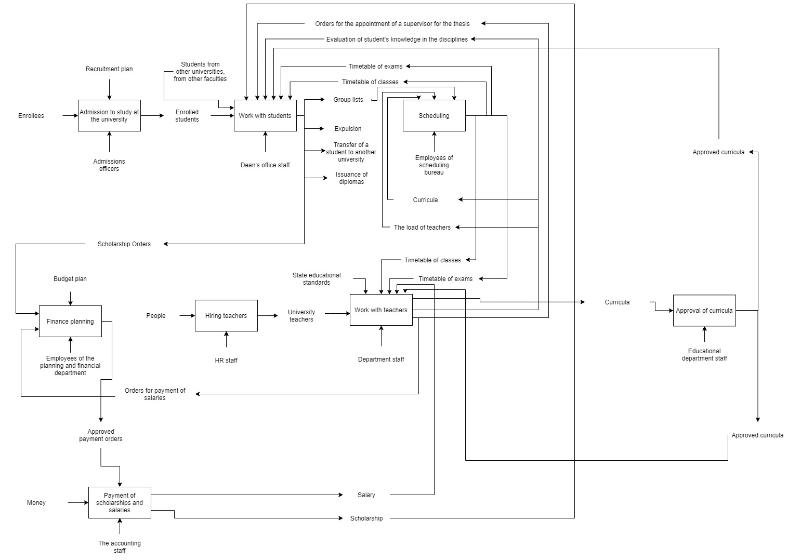
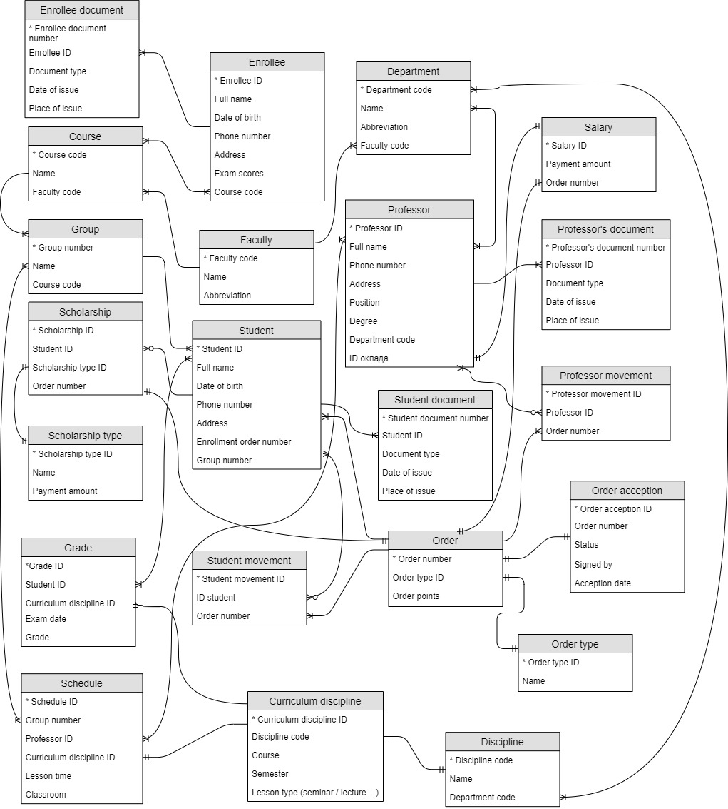

# University-Database
Russian university database design.

## Project description
The database design of a typical Russian university was carried out, taking into account all the features of the organization.

1. **Determining data to be stored.** To describe the work of the university, all business processes occurring in it were deeply analyzed. After that, a model was built to demonstrate how the university works.

2. **Logically structuring data.** Once the relationships and dependencies amongst the various pieces of information have been determined, it is possible to arrange the data into a logical structure which can then be mapped into the storage objects supported by the database management system. In relational databases the storage objects are tables which store data in rows and columns. The way this mapping is generally performed is such that each set of related data which depends upon a single object, whether real or abstract, is placed in a table. Relationships between these dependent objects is then stored as links between the various objects. To design databases in an efficient way, entity-relationship model (ER-diagram) was built.

3. **Physical design.** The physical design of the database specifies the physical configuration of the database on the storage media. This includes detailed specification of data elements, data types, indexing options and other parameters. On the basis of the analysis produced was written a script that creates the university database.
